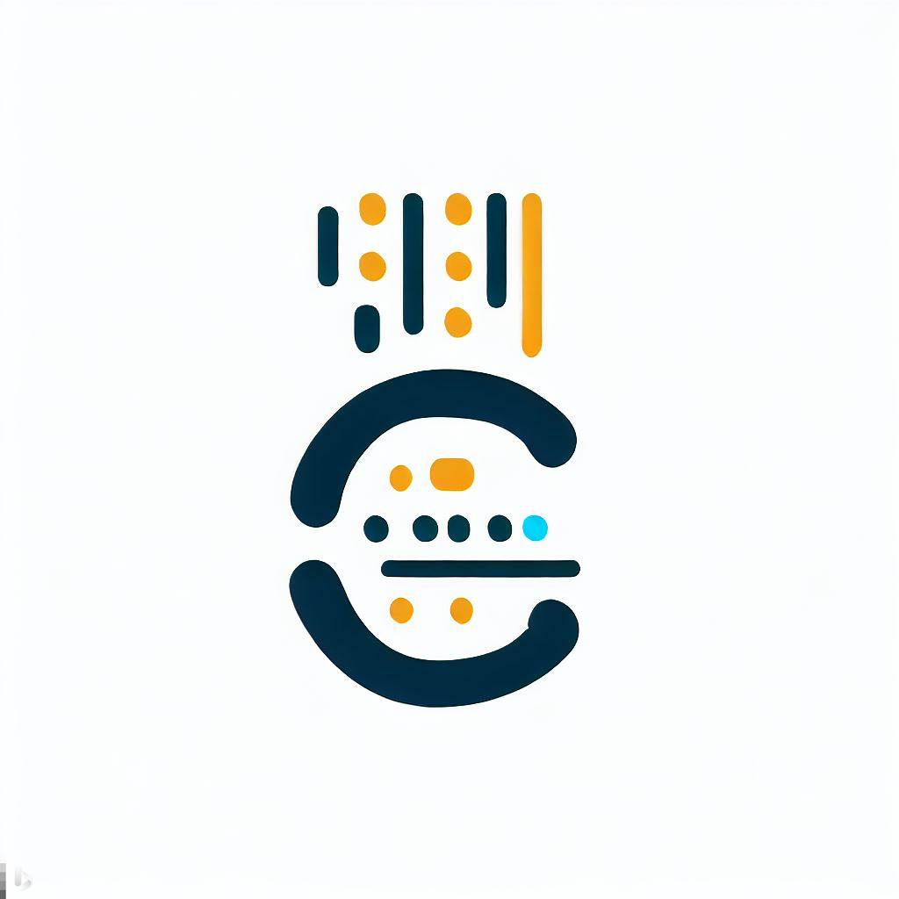

# BeatCode

> 2023年上海交通大学软件学院暑期课程《互联网产品设计与开发》课程项目。

感谢沈备军老师和任锐老师的授课。

## 项目简介

本项目为一个在线代码评测平台（oj）。
- 前端使用`react`框架
- 后端使用`spring cloud`框架
- 数据库使用`mysql`和`mongodb`
- 缓存使用`spring cache`
- 后端评测结果使用`websocket`实时推送

## 项目贡献

小组成员工作如下：

| 姓名 | 工作内容 | 成员 |
| :---: | :---: | :---: |
| [PeterTheSparrow](https://github.com/PeterTheSparrow) | 前端主要编写者；后端鉴权部分代码、用户服务编写 | 齁弱的组长 |
| [KarH-in-dream](https://github.com/KarH-in-dream) | 后端微服务框架搭建、后端鉴权服务、题库服务编写、后端代码结构优化 | 组员 |
| [ReV3nus](https://github.com/ReV3nus) | 评测服务编写；前端相关界面编写；题库服务编写 | 组员 |
| [iqichen](https://github.com/iqichen) | 后端用户服务编写；项目部署与运维 | 组员 |

## 仓库地址

| 仓库名称 | 仓库地址 |
| :---: | :---: |
| 前端 | https://github.com/PeterTheSparrow/BeatCode-SE2320-SJTU-2023Summer-frontend |
| 后端 | https://github.com/PeterTheSparrow/BeatCode-SE2320-SJTU-2023Summer-backend
